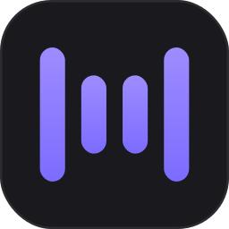

<div align="center" style="border-bottom: none">
    <h1>
        
        <br>
        Murmur
    </h1>
    <a href="LICENSE.md"></a>
    
    <p align="center">

A privacy-first AI meeting assistant that captures, transcribes, and summarizes meetings entirely on your machine. No cloud, no accounts, no data leaving your computer.

</p>

</div>

---

> Murmur began as a fork of [Meetily by Zackriya Solutions](https://github.com/Zackriya-Solutions/meeting-minutes) and has been heavily restructured since: the Python/FastAPI backend was removed entirely (everything runs inside the Tauri app now), the UI was redesigned, and several features were added on top. See [What's different from upstream](#whats-different-from-upstream).

## Introduction

Murmur runs entirely on your local machine. It captures your meetings (microphone + system audio), transcribes them in real time, and generates summaries — all locally. That makes it a good fit for anyone who needs to keep sensitive conversations under their own control.

- **Privacy First:** All processing happens locally on your device.
- **Cost-Effective:** Uses open-source AI models instead of expensive APIs.
- **Flexible:** Works offline and with any meeting platform (it captures system audio, not a bot in the call).
- **Customizable:** Self-hosted by definition — it's a desktop app you build and own.

## What's different from upstream

- **Backend-free architecture** — the upstream Python/FastAPI backend and Docker stack are gone. Persistence is local SQLite inside the Rust core; summaries and chat run in-process.
- **Redesigned UI** — a dark-first interface with light/dark themes and a custom window chrome.
- **Rust-native speaker diarization** — identify who spoke, powered by sherpa-onnx, with mic masking and an optional speaker-count hint. No HuggingFace token or Python required.
- **Transcript editor** — edit segment text, merge/split segments, and reassign or rename speakers from the UI.
- **Speaker-attributed AI** — summaries and meeting chat see `Speaker: text` labels, so answers can attribute statements to people.
- **Per-meeting chat** — ask questions about a meeting, grounded in its transcript, with markdown rendering and message persistence.
- **LM Studio provider** — alongside Ollama, Claude, OpenAI, Groq, OpenRouter, custom OpenAI-compatible endpoints, and a bundled llama.cpp sidecar.
- **Built-in MCP server** — read-only [Model Context Protocol](https://modelcontextprotocol.io) access to your meetings database, built into the app binary. Point any MCP client (Claude Desktop, Claude Code, Cursor, …) at the Murmur executable with the `--mcp` flag — no Python, no separate install:

  ```json
  {
    "mcpServers": {
      "murmur": {
        "command": "C:\\Program Files\\Murmur\\murmur.exe",
        "args": ["--mcp"]
      }
    }
  }
  ```

  (macOS: `/Applications/Murmur.app/Contents/MacOS/murmur`.) Tools: `list_meetings`, `get_transcript`, `get_summary`, `get_meeting`, `search_transcripts`. The database is opened read-only and the GUI does not need to be running. Override the DB location with `--db <path>` or `MURMUR_DB_PATH` if needed.
- **Whisper output filtering** — reduces YouTube-style hallucinations in transcripts.
- **Markdown export** for meetings.
- **Zero telemetry** — all analytics (PostHog) and the auto-updater have been removed. The app makes no usage-tracking or version-check calls; the only network connections are model downloads and any LLM provider you explicitly configure. See [PRIVACY_POLICY.md](PRIVACY_POLICY.md).

## Features

- **Local First:** All processing is done on your machine. No data ever leaves your computer.
- **Real-time Transcription:** Live transcript of your meeting as it happens, using **Whisper** or **Parakeet** models.
- **Speaker Diarization:** Identify and label individual speakers, locally.
- **AI-Powered Summaries & Chat:** Summarize meetings and chat with their transcripts using your choice of LLM provider.
- **Professional Audio Mixing:** Mic + system audio with RMS-based ducking and clipping prevention.
- **GPU Accelerated:** Metal/CoreML on macOS, CUDA or Vulkan on Windows/Linux.
- **Multi-Platform:** macOS, Windows, and Linux.

## Installation

Build from source (see the [Building guide](docs/BUILDING.md) for prerequisites and details):

```bash
git clone https://github.com/RenzoBeux/murmur
cd murmur/frontend
pnpm install
pnpm tauri:build          # auto-detects your GPU (CUDA/Metal/Vulkan/CPU)
```

Convenience wrappers with clean rebuild and logging:

- **Windows:** `clean_run_windows.bat` (dev) / `clean_build_windows.bat` (production)
- **macOS/Linux:** `./clean_run.sh` (dev) / `./clean_build.sh` (production)

## System Architecture

Murmur is a single, self-contained application built with [Tauri](https://tauri.app/): a Rust core (audio pipeline, STT engines, SQLite, LLM clients) with a Next.js frontend.

For more details, see the [Architecture documentation](docs/architecture.md) and [CLAUDE.md](CLAUDE.md).

## For Developers

You'll need Rust, Node.js, and pnpm. For detailed build instructions — including GPU acceleration setup per platform — see the [Building from Source guide](docs/BUILDING.md) and the [GPU Acceleration guide](docs/GPU_ACCELERATION.md). Contribution workflow is in [CONTRIBUTING.md](CONTRIBUTING.md).

## License

MIT License — see [LICENSE.md](LICENSE.md). Copyright © 2026 Renzo Beux; original work copyright © 2024 Zackriya Solutions.

## Acknowledgments

- Murmur is a fork of [Meetily / meeting-minutes](https://github.com/Zackriya-Solutions/meeting-minutes) by **Zackriya Solutions** — thanks for open-sourcing an excellent foundation.
- Code was borrowed from [Whisper.cpp](https://github.com/ggerganov/whisper.cpp), [Screenpipe](https://github.com/mediar-ai/screenpipe), and [transcribe-rs](https://crates.io/crates/transcribe-rs).
- Thanks to **NVIDIA** for the **Parakeet** model, and to [istupakov](https://huggingface.co/istupakov/parakeet-tdt-0.6b-v3-onnx) for the ONNX conversion.
- Speaker diarization is powered by [sherpa-onnx](https://github.com/k2-fsa/sherpa-onnx).
